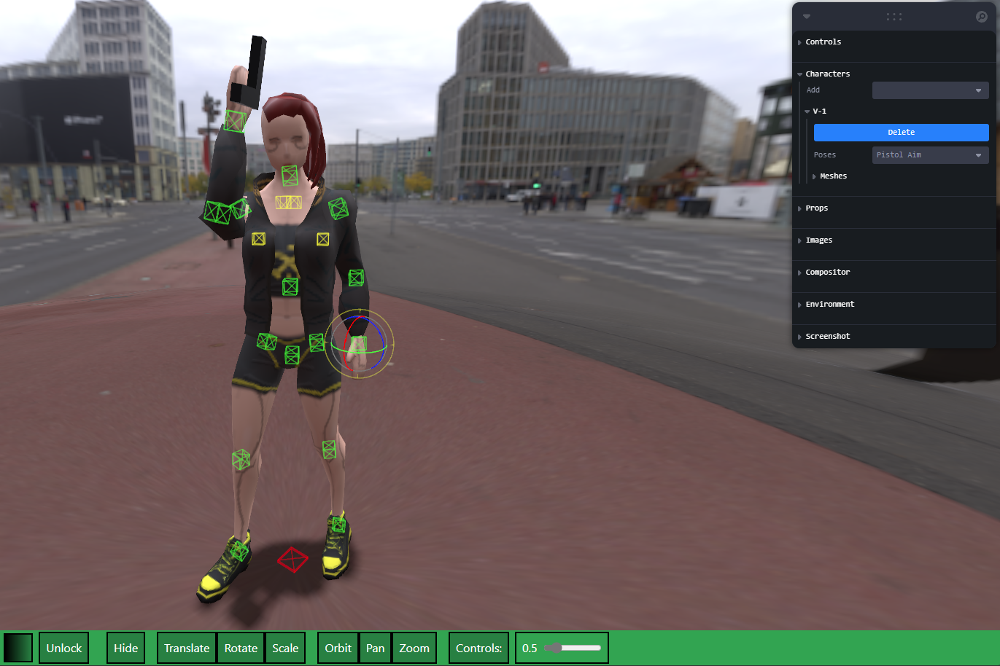

# Poser FK2

Live Link:
https://sbingley22.github.io/poser-glb/

A simple model posing app using various character themes. 
Double click to hide / show controls.
MB4 to toggle translate rotate.
Drag and drop glb files to load character, they must be rigged with a blender rigify basic rig.
Drag and drop img textures.

